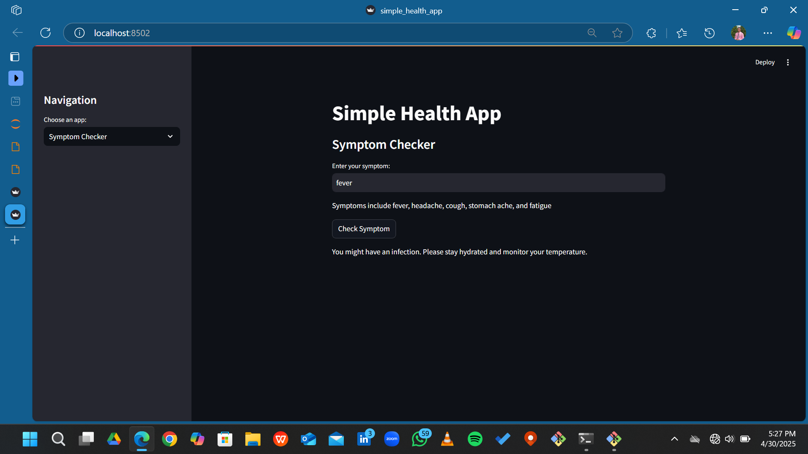
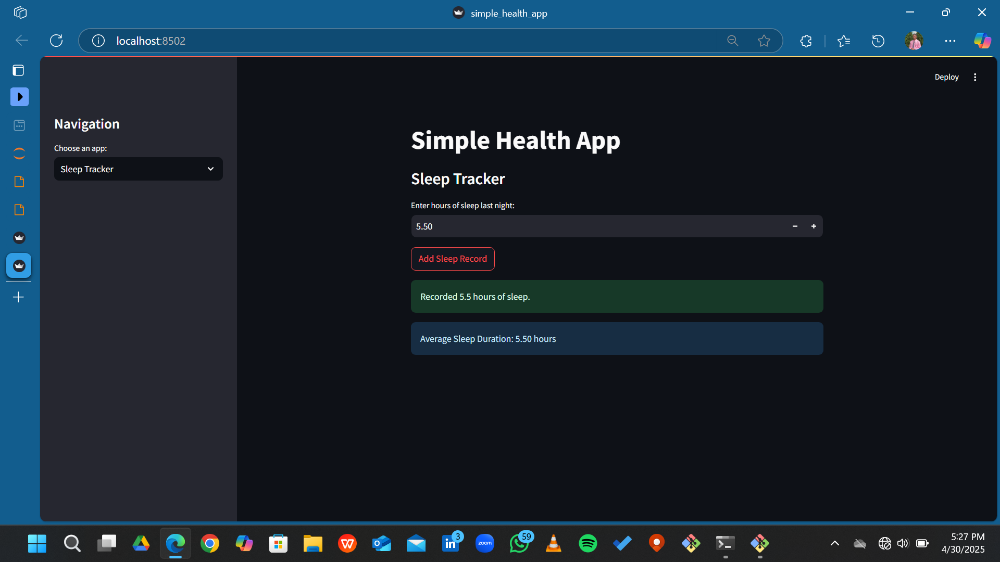
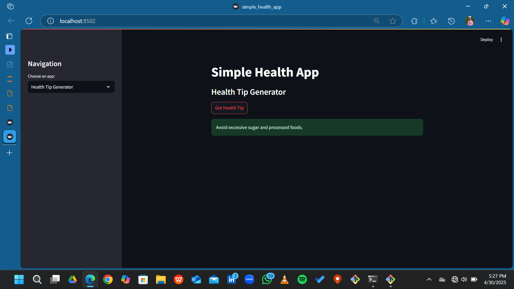
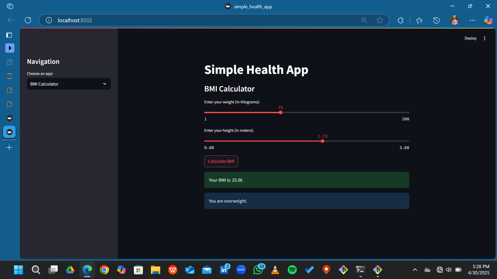

# Simple Health App (4-in-1 Tool)

A lightweight Streamlit web application offering four essential health utilities in one place:
- Symptom Checker
- Sleep Tracker
- Health Tip Generator
- BMI Calculator

---

## Problem Statement

Quick access to basic health monitoring tools helps individuals stay aware of their health. However, most apps providing such tools are either too complex, require login/signup, or are scattered across different platforms.

## Solution

This Streamlit app combines four essential health utilities into a single, easy-to-use dashboard. Users can check symptoms, track sleep habits, receive health tips, and monitor their BMI — without any account creation or heavy installations.

---

## Features

- **Symptom Checker**: Get basic advice based on your symptoms
- **Sleep Tracker**: Log your daily sleep and calculate average hours
- **Health Tip Generator**: Receive random health tips
- **BMI Calculator**: Calculate your Body Mass Index based on weight and height
- **Sidebar Menu**: Quickly switch between all four tools
- **Minimalistic Interface**: Focused and easy to use

---

## How to Run

1. Install Streamlit:
pip install streamlit
2. Clone this repository:
3. Run this app
streamlit run app.py

---

## Screenshots

| Symptom Checker | Sleep Tracker | Health Tips | BMI Calculator |
|:---------------:|:-------------:|:-----------:|:--------------:|
|  |  |  |  |

---

## Technologies Used

- Python
- Streamlit

---

## Future Improvements

- Expand symptom database for better advice
- Connect to a backend to store sleep records long-term
- Personalize health tips based on user's profile

---

This is a simple project to practice my python programming skills.
